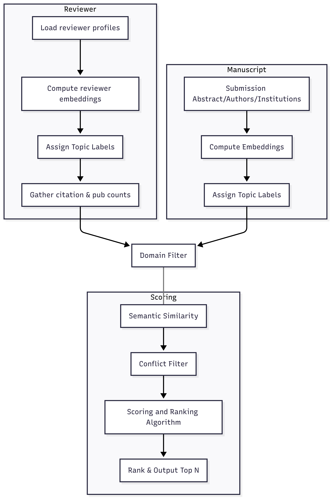

# Multi-Factor Integrity-Aware Reviewer Matching Pipeline

## Research Overview

This research addresses critical challenges in scholarly peer review by developing and evaluating a multi-factor, integrity-aware reviewer matching pipeline that integrates semantic similarity analysis, conflict of interest detection, and scholarly impact assessment within a transparent, configurable framework.

### Research Objectives

This project investigates whether multi-factor algorithmic approaches can enhance both the relevance and efficiency of reviewer assignments while preserving the quality standards essential to rigorous peer review. To ensure methodological feasibility and enable rigorous evaluation, the study focuses on manuscripts within the social network graph research domain, providing a specific context for empirical validation while developing approaches applicable across disciplinary boundaries.

### Methodological Advances

The study implements several key methodological innovations:

- **Temporal Validation**: Uses 2025 abstracts against 2020-2024 training data to assess generalization capabilities
- **Explicit Bias Mitigation**: Incorporates h-index penalties and normalized bibliometric indicators
- **Multi-dimensional Expertise Representation**: Integrates semantic similarity with conflict of interest detection
- **Transparent Framework**: Provides configurable parameters for different review scenarios

These advances address critical needs as scholarly publishing increasingly relies on algorithmic assistance to maintain both quality and fairness at scale.

## System Architecture


*Figure 2: Multi-factor reviewer matching pipeline architecture showing the integration of semantic analysis, conflict detection, and impact assessment components.*

The pipeline processes manuscript abstracts through multiple evaluation layers:

1. **Semantic Similarity Analysis** - Natural language processing to match research topics
2. **Conflict of Interest Detection** - Automated screening for potential reviewer conflicts
3. **Scholarly Impact Assessment** - Bibliometric evaluation with bias mitigation
4. **Integrated Scoring** - Multi-factor ranking with configurable weightings

## Research Domain Focus

The evaluation specifically targets **social network graph research** manuscripts, providing:
- Controlled experimental conditions for validation
- Domain-specific expertise modeling
- Generalizable methodologies for broader application
- Empirical benchmarks for algorithm performance

## Getting Started

This project was bootstrapped with Create React App to provide an interactive interface for the reviewer matching system.

### Prerequisites

- Node.js (version 14 or higher)
- npm or yarn package manager
- Access to research datasets (manuscript abstracts and reviewer profiles)

### Installation

1. Clone the repository
2. Install dependencies:
   ```bash
   npm install
   ```

### Available Scripts

In the project directory, you can run:

#### `npm start`
Runs the app in development mode. Open [http://localhost:3000](http://localhost:3000) to view it in your browser.
The page will reload when you make changes. You may also see any lint errors in the console.

#### `npm test`
Launches the test runner in interactive watch mode. See the section about [running tests](https://facebook.github.io/create-react-app/docs/running-tests) for more information.

#### `npm run build`
Builds the app for production to the `build` folder. It correctly bundles React in production mode and optimizes the build for the best performance.
The build is minified and the filenames include the hashes. Your app is ready to be deployed!

#### `npm run eject`
**Note: this is a one-way operation. Once you `eject`, you can't go back!**

If you aren't satisfied with the build tool and configuration choices, you can `eject` at any time. This command will remove the single build dependency from your project and copy all configuration files and dependencies (webpack, Babel, ESLint, etc) directly into your project for full control.

You don't have to use `eject`. The curated feature set is suitable for most deployments, but this option provides complete customization when needed.

## Research Configuration

### Pipeline Parameters

The system allows configuration of multiple matching factors:

- **Semantic Weight**: Influence of topic similarity (0.0-1.0)
- **COI Threshold**: Conflict of interest detection sensitivity
- **Impact Normalization**: Bibliometric bias mitigation level
- **Temporal Decay**: Recency weighting for reviewer expertise

### Evaluation Modes

- **Training Mode**: Uses 2020-2024 historical data
- **Validation Mode**: Tests against 2025 abstracts
- **Cross-Validation**: K-fold evaluation across time periods
- **Bias Assessment**: Fairness metric calculation

## Data Requirements

### Input Formats

- **Manuscripts**: Abstract text, metadata, submission dates
- **Reviewer Profiles**: Publication history, h-index, institutional affiliations
- **Ground Truth**: Historical review assignments for validation

### Output Metrics

- Relevance scores and rankings
- Conflict of interest flags
- Bias mitigation effectiveness
- Computational efficiency measures

## Contributing

This research project welcomes contributions in several areas:

- Algorithm improvements for semantic matching
- Enhanced bias detection and mitigation
- Extended evaluation metrics
- Cross-disciplinary validation studies

## Research Impact

This work contributes to the growing field of algorithmic peer review assistance by providing:

- Empirically validated multi-factor matching approaches
- Transparent bias mitigation strategies  
- Configurable frameworks for different review contexts
- Open methodologies for reproducible research

## License

This research project is available for academic and non-commercial use. Please cite appropriately when using methodologies or code from this work.

## Contact

For questions about the research methodology or technical implementation, please refer to the project documentation or contact the research team.

---

*This project represents ongoing research into improving the fairness, efficiency, and quality of scholarly peer review through algorithmic assistance while maintaining the integrity essential to rigorous academic evaluation.*