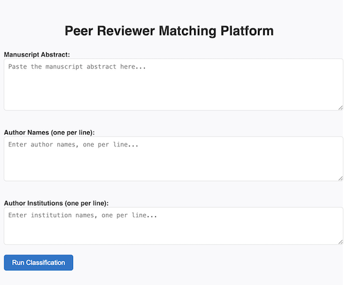

# Multi-Factor Reviewer Recommendation Pipeline

## Overview

This project addresses critical challenges in scholarly peer review by developing and evaluating a multi-factor, integrity-aware reviewer recommendation pipeline that integrates semantic similarity analysis, conflict of interest detection, and scholarly impact assessment within a transparent, configurable framework.

### Objectives

This project investigates whether multi-factor algorithmic approaches can enhance both the relevance and efficiency of reviewer assignments while preserving the quality standards essential to rigorous peer review. To ensure methodological feasibility and enable evaluation, the study focuses on manuscript abstracts within the social network graph research domain, providing a specific context for empirical validation while developing approaches applicable across disciplinary boundaries.

## Platform Overview



The platform accepts manuscript abstracts, author names, and affiliations to generate:

1. **Domain and Topic Classification** - To classify the submitted abstract into a topic domain
2. **Integrated Scoring and Ranking** - Multi-factor ranking with configurable weightings

## Research Domain Focus

The evaluation specifically targets **social network graph research** manuscripts, providing:
- Controlled experimental conditions for validation
- Domain-specific expertise modeling
- Generalizable methodologies for broader application
- Empirical benchmarks for algorithm performance

## Getting Started

This project was bootstrapped with Create React App to provide an interactive interface for the reviewer matching system.

### Prerequisites

- Node.js (version 14 or higher)
- npm or yarn package manager
- Access to research datasets (manuscript abstracts and reviewer profiles)

### Installation

1. Clone the repository
2. Install dependencies:
   ```bash
   npm install
   ```

### Available Scripts

In the project directory, you can run:

#### `npm start`
Runs the app in development mode. Open [http://localhost:3000](http://localhost:3000) to view it in your browser.
The page will reload when you make changes. You may also see any lint errors in the console.

#### `npm test`
Launches the test runner in interactive watch mode. See the section about [running tests](https://facebook.github.io/create-react-app/docs/running-tests) for more information.

#### `npm run build`
Builds the app for production to the `build` folder. It correctly bundles React in production mode and optimizes the build for the best performance.
The build is minified and the filenames include the hashes. Your app is ready to be deployed!

#### `npm run eject`
**Note: this is a one-way operation. Once you `eject`, you can't go back!**

If you aren't satisfied with the build tool and configuration choices, you can `eject` at any time. This command will remove the single build dependency from your project and copy all configuration files and dependencies (webpack, Babel, ESLint, etc) directly into your project for full control.

You don't have to use `eject`. The curated feature set is suitable for most deployments, but this option provides complete customization when needed.

## Data Requirements

### Input Formats

- **Manuscripts**: Abstract text, metadata, submission dates
- **Reviewer Profiles**: Publication history, h-index, institutional affiliations
- **Ground Truth**: Historical review assignments for validation

### Output Metrics

- Relevance scores and rankings
- Conflict of interest flags
- Bias mitigation effectiveness
- Computational efficiency measures

## License

This research project is available for academic and non-commercial use. Please cite appropriately when using methodologies or code from this work.

## Contact

For questions about the research methodology or technical implementation, please refer to the project documentation or contact the author.

## Running tests

You can run the Python tests with either pytest or the built-in unittest runner.

- Using pytest (recommended):

```
pip install pytest
pytest -q
```

- Using unittest (no extra install):

```
python -m unittest discover -s api/tests -p "test_*.py"
```

## Environment variables

Create a `.env` file in the project root (or in `api/`) to configure optional settings:

```
email=your.name@example.com
```

The backend loads `.env` automatically on startup and will pass `email` to OpenAlex requests (for polite API usage).

